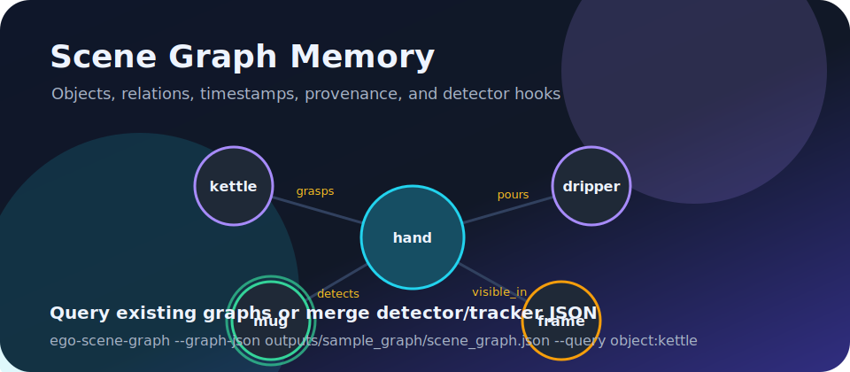
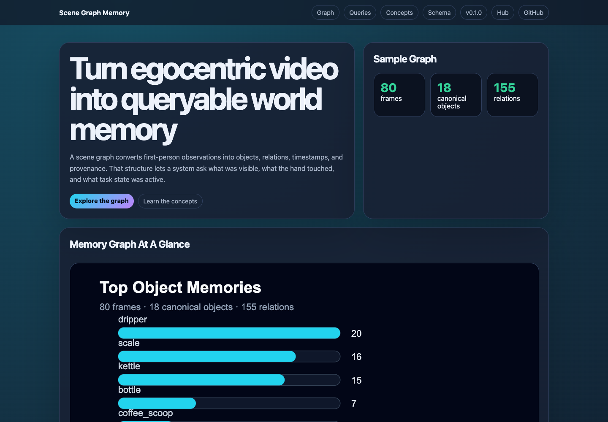

# Scene Graph From Egocentric Video

[](https://github.com/ChaoYue0307/scene-graph-from-egocentric-video/actions/workflows/ci.yml)

Learn how to convert first-person video annotations into a structured world
memory that can answer questions about objects, hand-object interactions, and
task state.

Part of the Egocentric Vision Learning Hub:
https://chaoyue0307.github.io/egocentric-vision-learning-hub/

The graph connects four kinds of evidence:

- object names from caption annotations,
- interaction text such as "hand grasping the kettle",
- task segments and action intervals,
- SLAM camera poses attached to timestamps.





Short walkthrough recording: [`docs/assets/walkthrough.webm`](docs/assets/walkthrough.webm)

## Interactive Tutorial

Open the visual graph walkthrough:

- Web page: https://chaoyue0307.github.io/scene-graph-from-egocentric-video/
- Local copy: open `docs/index.html` in a browser.

The page includes a graph visual, query switcher, timeline examples, direct
concept explanations, and schema checklist.

## What You Will Learn

- **Scene graph:** a structured representation made of objects and relations.
- **Object-centric memory:** tracking each object across time.
- **Temporal relation:** a relation attached to a timestamp or segment.
- **Hand-object interaction:** a relation such as `hand_grasps(kettle)`.
- **World state query:** a question like "what objects are visible now?"
- **Spatial memory:** answering "where did I last see the kettle?" from SLAM poses.
- **Provenance:** metadata that records where each graph fact came from.
- **Graph evaluation:** scoring the exported graph against human-labeled QA pairs.

## Data

Raw videos, `annotation.hdf5`, and `.rrd` files stay outside git. Set
`DATA_ROOT` to your local Xperience-10M sample:

```bash
export DATA_ROOT=/path/to/xperience-10m-sample
```

See `DATA_NOTICE.md`, `DATA_CARD.md`, and `EVALUATION_CARD.md` for the data contract, intended use, graph checks, and limitations.

## Repository Map

| Path | Purpose |
| --- | --- |
| `scripts/scene_graph_demo.py` | graph export and query entry point |
| `scripts/evaluate_graph_qa.py` | QA accuracy scoring against human-labeled pairs |
| `eval/qa_pairs.json` | 33 human-labeled questions with gold answers |
| `scripts/adapters.py` | source boundary for caption and detector inputs |
| `notebooks/03_scene_graph_queries.ipynb` | step-by-step notebook companion |
| `reports/scene_graph_memory_report.md` | paper-style method, artifact, and limitation summary |
| `docs/index.html` | interactive scene graph tutorial webpage |
| `docs/concepts.md` | glossary for scene graph and world-memory terms |
| `outputs/sample_graph/scene_graph.json` | sample temporal graph |
| `outputs/sample_graph/query_results.json` | sample object, interaction, and state queries |

## Common Commands

```bash
make test
make help
make visuals
make pages
```

## Build The Scene Graph

```bash
python3 -m venv .venv
source .venv/bin/activate
pip install -r requirements.txt

python scripts/scene_graph_demo.py \
  --data-root "$DATA_ROOT" \
  --output-dir outputs/sample_graph \
  --max-frames 80 \
  --query object:kettle \
  --query interactions \
  --query state:last
```

After installing the project, the same CLI is available as:

```bash
pip install -e .
ego-scene-graph --data-root "$DATA_ROOT" --output-dir outputs/sample_graph
```

To query an existing graph without raw data:

```bash
ego-scene-graph \
  --graph-json outputs/sample_graph/scene_graph.json \
  --query object:kettle \
  --query state:last
```

To merge detector or tracker output, pass a JSON file with timestamped objects:

```bash
ego-scene-graph \
  --data-root "$DATA_ROOT" \
  --detections-json outputs/detections.json
```

This repo includes `docs/data/sample_detections.json`, an annotation-grounded
detector/tracker fixture used to exercise the merge path and provenance logic.
For a more visual path, run `make visual-detections`; it creates OpenCV contour
proposals from real video frames and writes `docs/data/visual_detections.json`.

To compare a detector-merged graph against a caption-only graph:

```bash
ego-scene-graph \
  --graph-json outputs/detector_graph/scene_graph.json \
  --compare-graph-json outputs/sample_graph/scene_graph.json \
  --output-dir outputs/graph_comparison
```

Minimal detection record:

```json
{
  "detections": [
    {
      "frame_index": 12,
      "objects": [
        {"label": "mug", "track_id": "track-7", "confidence": 0.91, "bbox_xyxy": [120, 80, 240, 260]}
      ]
    }
  ]
}
```

## Outputs

| Output | What To Inspect |
| --- | --- |
| `scene_graph.json` | frames, objects, relations, task segments, provenance, confidence, and per-object camera trails |
| `qa_results.json` | QA accuracy report with per-question-type breakdown |
| `schema.json` | the graph contract shared by exporters and query tools |
| `query_results.json` | example answers for object timelines, interactions, and state |
| `graph_comparison.json` | caption-only versus detector-merged graph comparison when requested |
| `docs/data/sample_detections.json` | detector/tracker-style fixture with bounding boxes, confidence, and track ids |
| `docs/data/visual_detections.json` | OpenCV visual-proposal detector output associated with graph object labels |

## Relation Types

- `visible_in`: an object appears in the caption object list for a timestamp.
- `hand_grasps`, `hand_contacts`, `hand_pours_with`, `hand_moves_toward`: a
  hand-object interaction inferred from text and object matching.
- `action_active`: the current action label for that timestamp.

## Example Questions

```bash
python scripts/scene_graph_demo.py --data-root "$DATA_ROOT" --query object:kettle
python scripts/scene_graph_demo.py --data-root "$DATA_ROOT" --query interactions
python scripts/scene_graph_demo.py --data-root "$DATA_ROOT" --query state:last
python scripts/scene_graph_demo.py --data-root "$DATA_ROOT" --query where:kettle
```

## Spatial Memory: "Where Did I Last See The Kettle?"

Each object observation with a SLAM pose adds the wearer's camera position to
that object's `camera_trail`, and `where:<object>` answers with the position at
the last sighting. This is an egocentric proxy — the wearer's location when the
object was visible, not a triangulated object position — but for tabletop
manipulation the wearer stands within arm's reach of what they see, so the
proxy is useful for navigation-style queries and is honest about its
provenance. Triangulating true object positions from bounding boxes plus poses
is the natural next exercise.

## QA Evaluation

The graph is scored against 33 human-labeled QA pairs covering object memory,
alias resolution, visibility, interactions, task state, temporal order, and the
spatial proxy:

```bash
make qa-eval
# qa accuracy: 33/33 = 1.000
```

Gold answers in `eval/qa_pairs.json` were written by reading the episode
annotations directly, so this measures whether graph construction and query
logic preserve what a human can check — a regression benchmark for the builder,
not a perception benchmark. Negative questions (absent objects, wrong
relations, far-away positions) keep it from rewarding a graph that says yes to
everything. When a detector replaces caption objects as the source, the same
QA set becomes a real perception score.

This graph is rule-based and transparent. That makes it easy to inspect before
adding detector, segmenter, or language-model components.
